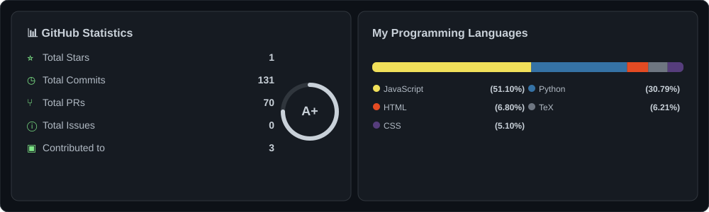

# GitHub Profile Stats Card 📊

An **automatically-updating** custom GitHub statistics card generated with Python and GitHub Actions — no external services required.

<div align="center">
  
</div>

---

## Project Structure

```
PragathiJayasinghe/
│
├── README.md                          ← This file
├── generate_stats.py                  ← Python generator script
├── requirements.txt                   ← Python dependencies
│
├── assets/
│   └── github-stats.svg               ← Auto-generated card (do not edit manually)
│
└── .github/
    └── workflows/
        └── update-stats.yml           ← GitHub Actions automation
```

---

## How Each Statistic Is Calculated

| Statistic | Method |
|---|---|
| **Total Stars** | Sum of `stargazers_count` across all non-forked public repos owned by the user |
| **Total Commits** | GitHub Commits Search API (`author:USERNAME`). May differ slightly from the profile contribution graph, which has its own counting rules |
| **Total PRs** | GitHub Issues Search API with `type:pr author:USERNAME` (includes open, closed, merged) |
| **Total Issues** | GitHub Issues Search API with `type:issue author:USERNAME` (pull requests are explicitly excluded) |
| **Contributed to** | Distinct repositories (not owned by the user) that appear in the public events stream. Best-effort approximation; limited to the most recent ~300 events |
| **Languages** | Byte-count totals from `/repos/{owner}/{repo}/languages` across all non-forked public repos, converted to percentages |

---

## Configuration

Edit the **`CONFIGURATION`** block at the top of [`generate_stats.py`](./generate_stats.py):

```python
GITHUB_USERNAME          = "PragathiJayasinghe"  # GitHub handle
GRADE                    = "A+"                  # Grade shown in the ring (cosmetic)
GRADE_PROGRESS           = 75                    # Ring fill percentage (0-100)
COMMITS_CURRENT_YEAR_ONLY = False                # True = current year only
INCLUDE_FORKS            = False                 # True = include forked repos
MAX_LANGUAGES            = 5                     # How many languages to display
```

---

## Running Locally

### Prerequisites

```bash
pip install -r requirements.txt
```

### With authentication (recommended — higher API rate limits)

1. Create a [GitHub Personal Access Token](https://github.com/settings/tokens) with the **`public_repo`** scope (read-only is sufficient for public data).
2. Export it as an environment variable:

```powershell
# Windows PowerShell
$env:GH_TOKEN = "ghp_your_token_here"
python generate_stats.py
```

```bash
# macOS / Linux
export GH_TOKEN="ghp_your_token_here"
python generate_stats.py
```

### Without a token (unauthenticated — 60 req/hour limit)

```bash
python generate_stats.py
```

The script will still work but may hit rate limits for accounts with many repositories.

---

## GitHub Actions Setup

The workflow in [`.github/workflows/update-stats.yml`](./.github/workflows/update-stats.yml) runs automatically every day at **00:30 UTC**.

### First-time setup

1. Push this repository to your GitHub profile repository (`PragathiJayasinghe/PragathiJayasinghe`).
2. Go to **Settings → Actions → General** and confirm "Read and write permissions" is enabled under *Workflow permissions*.
3. The `GITHUB_TOKEN` secret is provided automatically — no manual configuration is needed for public data.

### Manual trigger

1. Go to the **Actions** tab of your repository.
2. Click **"Update GitHub Stats Card"** in the left sidebar.
3. Click **"Run workflow"** → **"Run workflow"**.

### Using a Personal Access Token (PAT) for private repos

If you want to include private repository statistics:

1. Create a PAT at <https://github.com/settings/tokens> with `repo` scope.
2. Add it as a repository secret named **`STATS_TOKEN`**:
   - **Settings → Secrets and variables → Actions → New repository secret**
3. In `.github/workflows/update-stats.yml`, change:

```yaml
GH_TOKEN: ${{ secrets.GITHUB_TOKEN }}
```

to:

```yaml
GH_TOKEN: ${{ secrets.STATS_TOKEN }}
```

---

## GitHub Image Caching

GitHub caches images in READMEs via a CDN. If you need to force a refresh after a manual update, you can:

1. **Append a cache-bust query string** to the image URL in your README (this works only on GitHub Pages, not GitHub profile READMEs):
   ```html
   
   ```
2. **Wait** — the CDN cache typically expires within a few minutes to an hour.
3. **Hard-refresh** your browser with `Ctrl + Shift + R` (Windows/Linux) or `Cmd + Shift + R` (macOS).

---

## Troubleshooting

### SVG is not updating

- Check the **Actions** tab for workflow run errors.
- Confirm that *Workflow permissions* are set to **Read and write** under **Settings → Actions → General**.

### `HTTP 403` / Rate limit errors

- The unauthenticated rate limit is 60 requests/hour. Add a `GH_TOKEN` secret.
- If using `GITHUB_TOKEN`, the search API is rate-limited to 30 req/min. The script handles this automatically with a sleep.

### Commits count seems low

- The GitHub search commit index does not include every historical commit. This is a known limitation of the search API. The profile contribution graph uses a different internal counting system.

### Language bar appears empty

- This happens when all repos are forks and `INCLUDE_FORKS = False`. Either set `INCLUDE_FORKS = True` or push some original repositories.

### SVG is blank / malformed

- Run `python generate_stats.py` locally (with a valid `GH_TOKEN`) to see the exact error output.

---

## License

MIT
